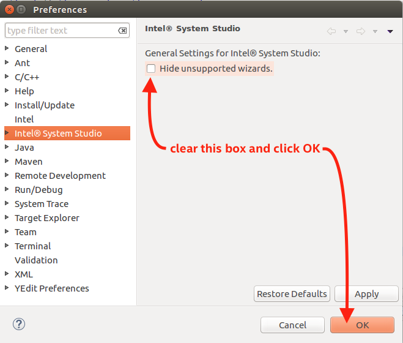
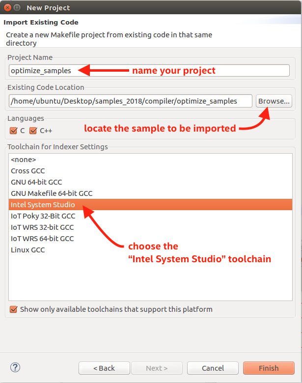
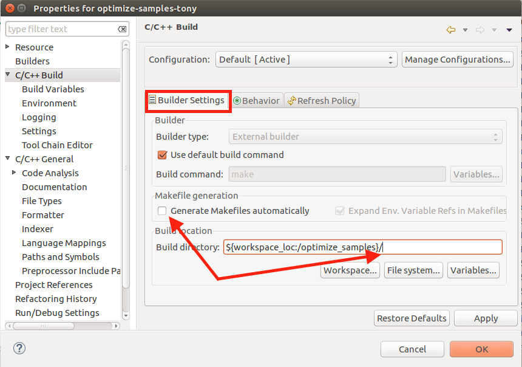

Samples for Intel® System Studio
================================

These samples illustrate features of many of the components included with Intel
System Studio. They are organized into folders that correspond to which
component they belong; for example, `compiler` contains Intel Compiler (`icc`)
samples, `gdb` contains Intel Debugger samples, etc.

>   Ignore any instructions within the `readme` files found in the sample
>   folders that reference installing Intel® Parallel Studio or Microsoft\*
>   Visual Studio.

Most of these samples *do not* have a proper Eclipse\* `.project` file for easy
import into the Intel System Studio development environment. For use within
Intel System Studio (i.e., within Eclipse) follow the instructions below.

>   **IMPORTANT!** At this time, these import instructions work *only* with
>   Intel System Studio for Linux.

Copy the Samples to Your Development System
-------------------------------------------

The simplest way to get a copy of the samples in this repo is to [download this
ZIP file][1] and expand it on your development system. Alternatively, you can
`git clone` this repo directly onto your system. See the green **Clone or
download** button for details on how to clone this repo.

[1]: https://github.com/intel-system-studio/samples/archive/master.zip

Import a Sample into Intel System Studio (Eclipse)
--------------------------------------------------

>   **IMPORTANT!** When you use the import procedure defined below, Eclipse will
>   *“import in place.”* This means the sample folder will be converted to an
>   Eclipse project, it *will not* be copied to your Eclipse workspace folder as
>   part of the import. If you want the sample to be located within your Eclipse
>   workspace you must first *copy* or *move* the sample to your workspace
>   folder before importing it.

These instructions will import the sample as a user-managed makefile project.
That is, all compile and link instructions are specified in a `Makefile`
supplied with the sample. This means you must modify the sample’s `Makefile` to
make changes to the build process, for example, if you want to change compiler
optimization options. This can be done by opening the sample’s `Makefile` in an
Eclipse edit window, since a makefile is an editable text file.

If a sample *does not* include a `Makefile` it cannot be imported using the
procedure described below. In that case, if the sample includes an Eclipse
`.project` file you can use the Eclipse import tool (`File > Import… > General >
Existing Projects into Workspace`) to open that project for use within Intel
System Studio.

>   It is also possible to use the command-line to build these projects, outside
>   of Intel System Studio. That usage is outside the scope of this README.

### Enable “unsupported” wizards

~~~~~~~~~~~~~~~~~~~~~~~~~~~~~~~~~~~~~~~~~~~~~~~~~~~~~~~~~~~~~~~~~~~~~~~~~~~~~~~~
Window > Preferences > Intel System Studio
~~~~~~~~~~~~~~~~~~~~~~~~~~~~~~~~~~~~~~~~~~~~~~~~~~~~~~~~~~~~~~~~~~~~~~~~~~~~~~~~

Clear the box labeled *“Hide unsupported wizards.”* and click the **OK** button.

>   NOTE: on Apple\* macOS\* the Preferences dialog is located in the
>   `Intel(R)System Studio` menu, not the `Window` menu.

### Import as a makefile project

~~~~~~~~~~~~~~~~~~~~~~~~~~~~~~~~~~~~~~~~~~~~~~~~~~~~~~~~~~~~~~~~~~~~~~~~~~~~~~~~
File > Import > C/C++ > Existing Code as Makefile Project
~~~~~~~~~~~~~~~~~~~~~~~~~~~~~~~~~~~~~~~~~~~~~~~~~~~~~~~~~~~~~~~~~~~~~~~~~~~~~~~~

Click the **FINISH** button.

>   Locate the folder that contains the `Makefile` for the sample you are
>   importing.

### Modify toolchain build details

Make sure you have selected (highlighted) your newly imported project in the
**Project Explorer** window.

Open the project properties so you can fine tune the build commands:

~~~~~~~~~~~~~~~~~~~~~~~~~~~~~~~~~~~~~~~~~~~~~~~~~~~~~~~~~~~~~~~~~~~~~~~~~~~~~~~~
Project > Properties > C/C++ Build > Tool Chain Editor
~~~~~~~~~~~~~~~~~~~~~~~~~~~~~~~~~~~~~~~~~~~~~~~~~~~~~~~~~~~~~~~~~~~~~~~~~~~~~~~~

Make sure the “**Current builder:**” field is configured to use the “**Gnu Make
Builder**.”

Select the **C/C++ Build** item from the list of properties on the left. Make
sure the “**Build Settings**” tab is selected and clear the “**Generate
Makefiles automatically**” checkbox is cleared. Also, be sure the “**Build
directory:**” field points to the root of your project (assuming that is where
the project `Makefile` is located).

On the same property panel, select the “**Behavior**” tab and change the
“**Build (Incremental build)**” field so it matches the `Makefile` build target
of interest.

>   **NOTE:** The precise name of the make target of interest depends on how the
>   sample’s `Makefile` has been written. Many of the sample makefiles have
>   multiple targets.

See the README file inside the sample you have imported for a description of the
make target(s) in order to figure out what target name to put in this field
(usually this information is in a section of the README titled *“for Linux\*
command-line users”*). If the README file is an html file (`readme.html`) you
can view it in the Eclipse edit window by double-clicking that file in the
Eclipse Project Explorer.

If it is unclear what the make target should be, leave this field blank or try
using “release” as the make target (as shown in the screenshot below).

### Build and run the project

Now that your project is configured, you can perform a build and run as you
would with any Eclipse project. If the make target is incorrect, you may see
build errors in the build output console; in that case, review the `Makefile`
and the included README for information regarding what the make targets do, and
update the make target name in the “**Build (Incremental build)**” field on the
“**Behavior**” tab of the “**C/C++ Build**” properties panel, as shown in the
screenshot above.

 

\* [Trademark Information][2].

[2]: https://www.intel.com/content/www/us/en/legal/trademarks.html
